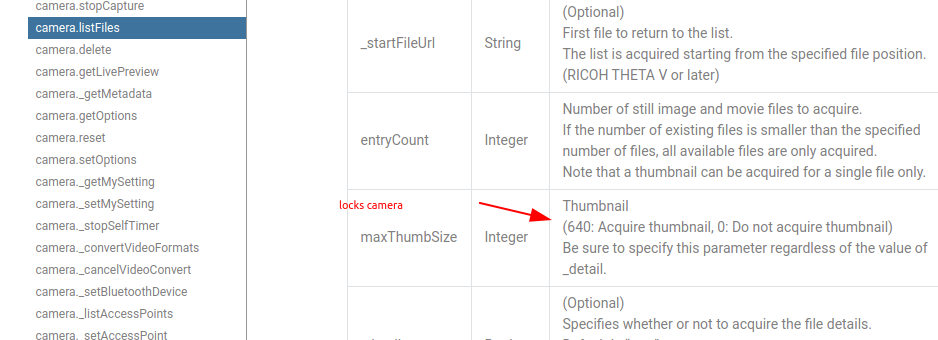
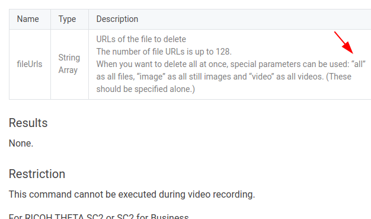

# SC2 API September Community Update

## Firmware Update

* SC2 for business: 6.12 released on Aug 25, 2020
* SC2: 1.42 released on September 3, 2020

## Problem Description and Fixes

With SC2B firmware version 6.01 and SC2 firmware 1.31, it was
not possible to delete and list all the files with thumbnails with a single API call.  Setting the 
`maxThumbSize` to 640 did not return thumbnails
and caused the camera to lock. 

New firmware addresses these problems. 

## Model

This is equivalent to firmware 1.31.

```
{
  "manufacturer": "RICOH",
  "model": "RICOH THETA SC2",
  "serialNumber": "40100146",
  "firmwareVersion": "06.01",
    ...
  },
  "apiLevel": [
    2
  ],
```

## camera.listFiles



Request

```dart
data = {
    'name': 'camera.listFiles',
    'parameters': {
      'fileType': 'image',
      'entryCount': 5,
      'maxThumbSize': 640,
      '_detail': true,
    }
  };
```

Response

No response.  Camera is locked and unresponsive.

## Delete All Files

Camera contains 5 images initially.



First, check that the files in the camera.

```dart
{
    'name': 'camera.listFiles',
    'parameters': {
      'fileType': 'image',
      'entryCount': 5,
      'maxThumbSize': 0,
      '_detail': true,
    }
  };
```

Note that I've set the `maxThumbSize` to zero as setting it to 640 will hang the camera.

```dart
200
{
  "name": "camera.listFiles",
  "results": {
    "entries": [
      {
        "name": "R0010005.JPG",
        "fileUrl": "http://192.168.1.1/files/thetasc2c0847dfebf755838793d3c13/100RICOH/R0010005.JPG",
        "size": 4172209,
        "isProcessed": true,
        "previewUrl": "",
        "dateTimeZone": "2020:08:30 10:28:00-07:00",
        "width": 5376,
        "height": 2688,
        "_thumbSize": 24532,
        "_recordTime": 0
      },
      {
        "name": "R0010004.JPG",
        "fileUrl": "http://192.168.1.1/files/thetasc2c0847dfebf755838793d3c13/100RICOH/R0010004.JPG",
        "size": 4098858,
        "isProcessed": true,
        "previewUrl": "",
        "dateTimeZone": "2020:08:19 09:58:34-07:00",
        "width": 5376,
        "height": 2688,
        "_thumbSize": 7275,
        "_recordTime": 0
      },
```

Running a delete all returns.

Request

```
{
    "name": "camera.delete",
    "parameters": {
      "fileUrls": ["all"]
    }
  };
```

Response.

```
HTTP status code: 200
{"name":"camera.delete","state":"done"}
```

However, checking the files on the camera shows that all the files remain.

```
...
        "height": 2688,
        "_thumbSize": 10517,
        "_recordTime": 0
      }
    ],
    "totalEntries": 5
  },
  "state": "done"
  ```

  ## Firmware Upgrade